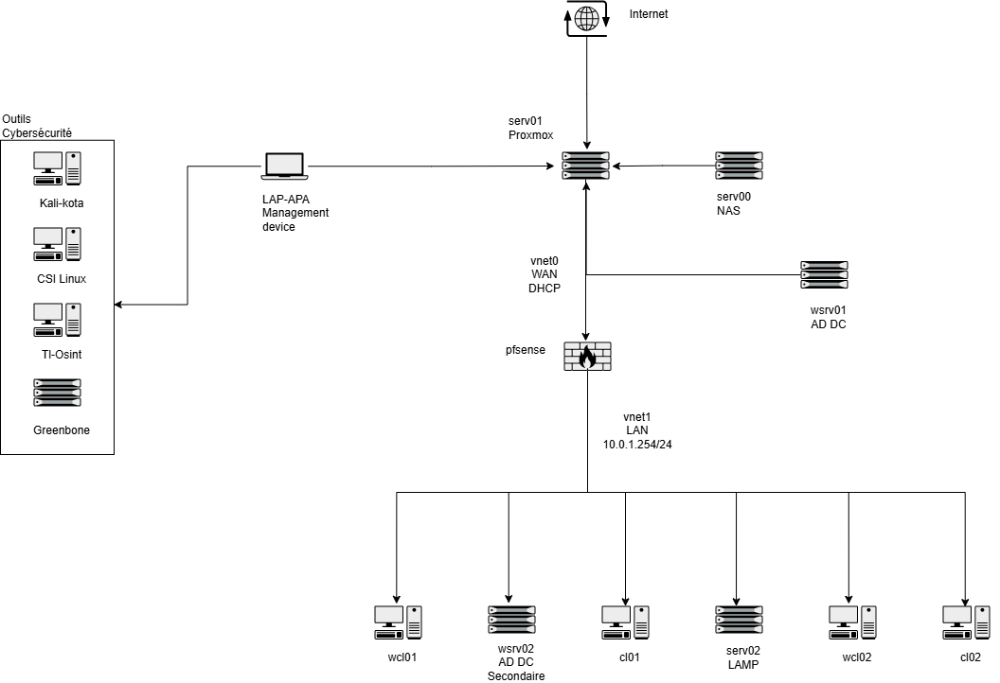

# 👋 Bonjour, je m'appelle Aurélien (kota-shen)
### 🛠️ Administrateur Systèmes & Réseaux | 🛡️ Auditeur Cybersécurité Freelance

---

## 🎓 Certifications & Diplômes
| Certification            | Badge                                                                                                     |
| :----------------------- | :-------------------------------------------------------------------------------------------------------- |
| **Google IT Support** |  |
| **IFAPME E6K Cyber** |      |
| **Blue Team Jr Analyst** |                                        |

---

## 🏗️ Mobile Audit Kit & HomeLab
> Ma configuration simule une intervention d'audit réelle : une station mobile interragissant avec une infrastructure d'entreprise virtualisée.

### 🛡️ Station d'Audit (Physique & VM)
* **Systèmes :** Kali Linux (Rolling) & CSI Linux (Investigation).
* **Outils :** Greenbone (OpenVAS), TL Osint, Nmap, Wireshark, Python.

### 🌐 Infrastructure Réseau & Sécurité
* **Firewalls :** Endian (Prévention) & pfSense (Protection & VPN).
* **Systèmes :** Active Directory (Win Server), Multi-OS (Win 10/11, Ubuntu, Fedora).
* **Observabilité :** Zabbix & GLPI.

---

## 🛠️ Stack Technique
| Catégorie | Badges |
| :--- | :--- |
| **Cybersécurité** |    |
| **Systèmes** |    |
| **Réseau** |   |
| **Monitoring** |   |

---

## 🚀 Roadmap de Déploiement
- [x] **Phase0:** [Proxmox Hypervisor setup (NAT routing & DHCP)](./infrastructure/proxmox/network-setup.md)
	- [x] Inventaire initial : [Fichier PDF](./documentation/inventory/Inventaire.pdf)
- [x] **Phase 1 :** Déploiement Win 10 Pro & Windows Server AD DS (GPO, DNS).
	- [x] [Déploiement Windows 10 Pro](./infrastructure/virtual-machines/Windows-10.md)
	- [x] [Déploiement Windows Serveur](./infrastructure/virtual-machines/Windows-server.md)
	- [x] [Installation et configuration de l'Active Directory](/infrastructure/services/ad-ds.md)
- [x] **Phase 2 :** Déploiement Ubuntu Desktop & Ubuntu serveur
	- [x] [Déploiement Ubuntu Desktop](/infrastructure/virtual-machines/Ubuntu.md)
	- [x] [Déploiement Ubuntu Serveur](/infrastructure/virtual-machines/Ubuntu-server.md)
	- [x] [Installation et configuration de LAMP](/infrastructure/services/LAMP.md)
- [x] **Phase 3 :** Déploiement Windows 11 & Fedora (Prep LPI Essentials).
	- [x] [Déploiement de Windows 11](/infrastructure/virtual-machines/Windows-11.md)
	- [x] [Déploiement de Fedora 44](/infrastructure/virtual-machines/Fedora.md)
- [ ] **Phase 4 :** [Déploiement pfSense](/infrastructure/virtual-machines/pfsense.md)
	- [ ] Déploiement second Active Directory
- [ ] **Phase 5 :** Audit & hardening
- [ ] **Phase 6 :** Déploiement Docker
- [ ] **Phase 7 :** Mise sous contrôle avec GLPI & Zabbix.
- [ ] **Phase 8 :** Sécurité avancée SIEM, IDS/IPS, Proxy

---

## 🎯 Objectif Business
Lancer mon activité de **Consultant en Cybersécurité**. Ce projet sert de "Proof of Concept" pour démontrer ma capacité à auditer, sécuriser et monitorer un parc informatique de PME de A à Z.

---

  <i>"Comprendre le système pour mieux le protéger."</i>

