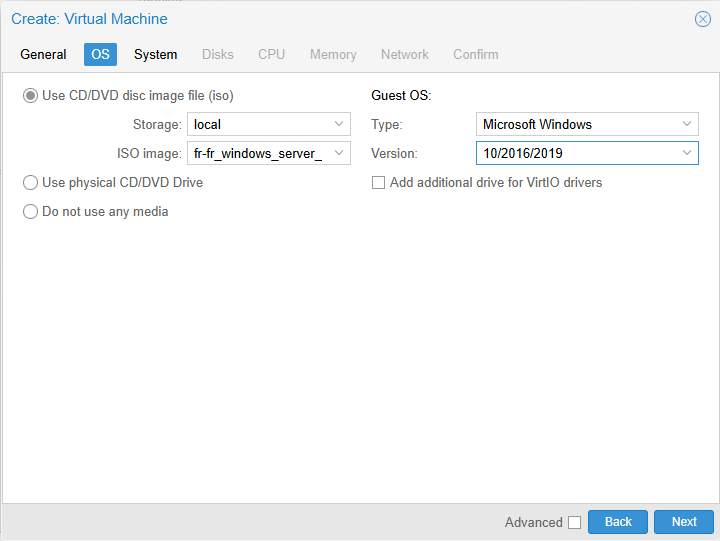
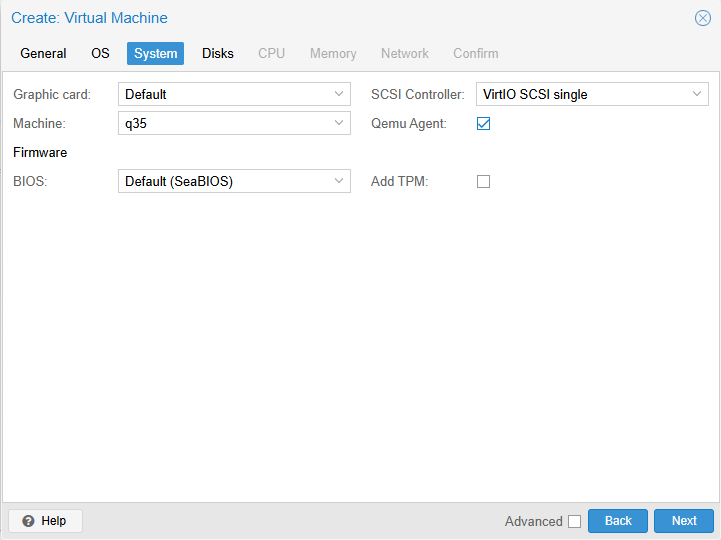
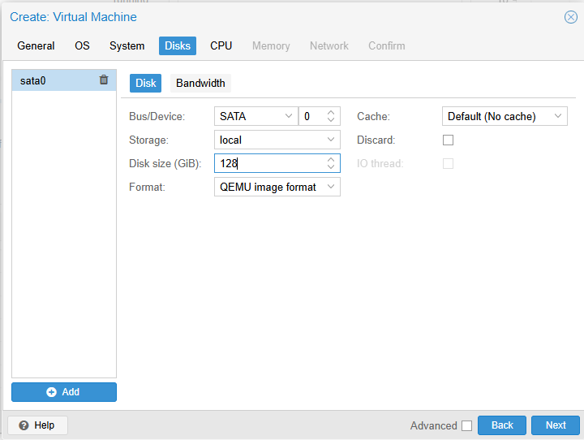
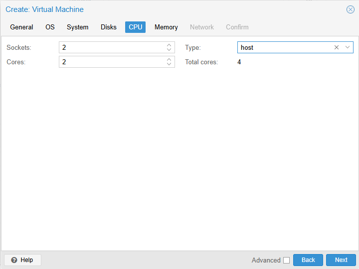
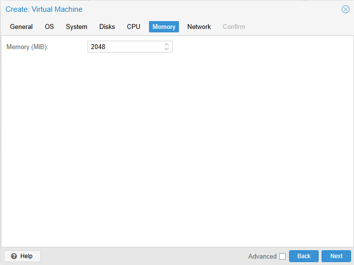
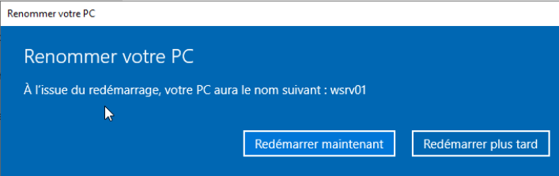

# 🖥️ Fiche Technique : [wsrv01]

## 📝 Présentation
*   **Rôle :** (Contrôleur de domaine
*   **Système d'exploitation :** Windows Server 2019
*   **Statut :** 🟢 Opérationnel

---

## ⚙️ Configuration Proxmox (Hardware)
| Composant    | Paramètre           | Note                           |
| :----------- | :------------------ | :----------------------------- |
| **ID VM**    | `3000`              | Suivi de l'inventaire          |
| **CPU**      | 4 vCPU (Type: Host) | Utiliser 'Host' pour perf max  |
| **RAM**      | 2 Go                | (Fixe ou Ballooning)           |
| **Disque**   | 128 Go (sATA)       | Cache: Write Back (Default)    |
| **Réseau**   | `vmbr0` (VirtIO)    | Pont vers Flat Network         |
| **BIOS/EFI** | OVMF (UEFI)         | Requis pour Win11 / SecureBoot |

---

## 🌐 Configuration Réseau
*   **Adresse MAC :** `BC:24:11:0C:81:34`
*   **Mode IP :** Statique manuelle
*   **Adresse IP :** `10.0.0.63`
*   **Passerelle :** `10.0.0.1`
*   **DNS :** `10.0.0.1` (Proxmox/dnsmasq)

---

## 🛠️ Installation & Post-Configuration
- [x] Installation de l'OS via ISO.
- [x] Installation des **VirtIO Drivers** (pour Windows).
- [x] Mises à jour système terminées.
- [x] Renommage du Hostname (ex: `CLI-WIN10-01`).
- [x] Snapshot "Clean Install" créé dans Proxmox.

---

## 📓 Notes de laboratoire
> *Note ici les problèmes rencontrés ou les réglages spécifiques (ex: désactivation du pare-feu Windows pour les tests ICMP initial).*

